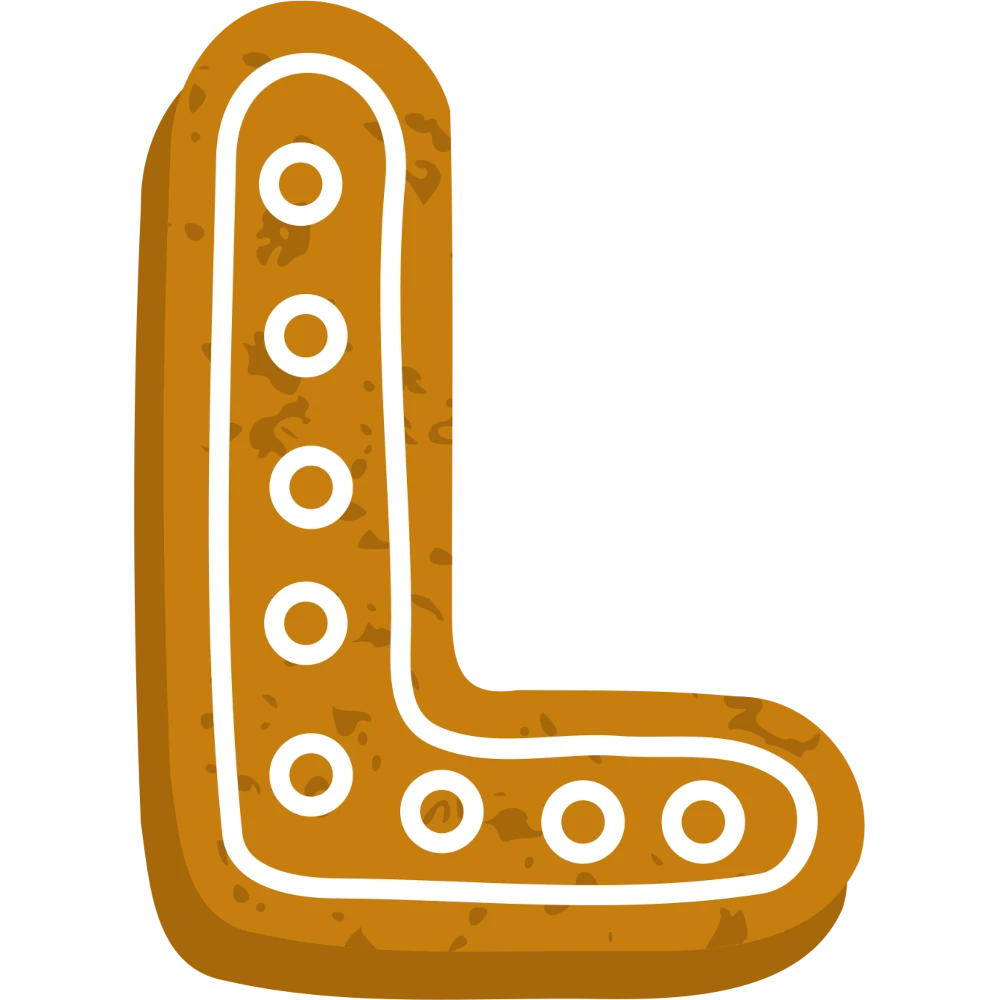
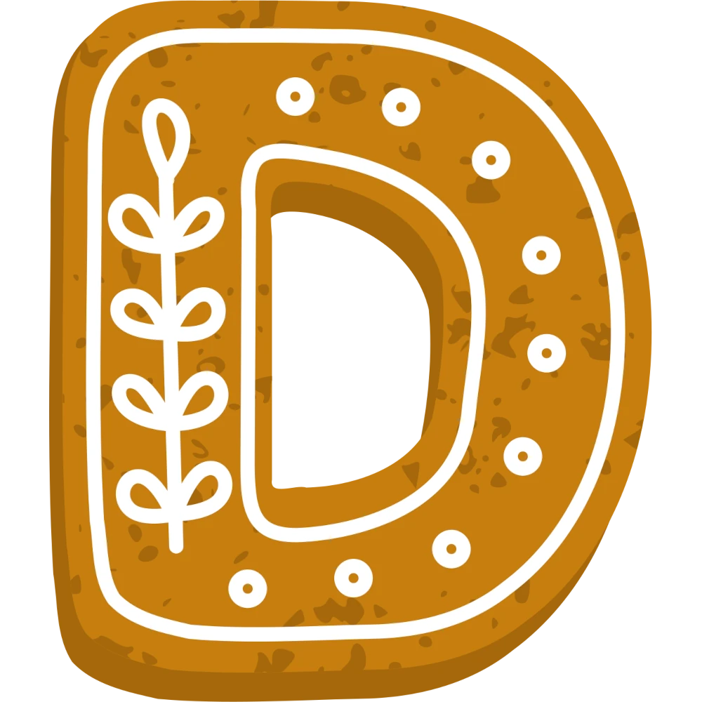

# BlendCascade

BlendCascade is a simple yet effective pure JavaScript library to obtain a cascading effect.

## How it looks

This is an example with falling letters, which are PNG files. Besides falling, here they also rotate (which is optional).

You can find a working demo which creates this inside `demo/`.

[demovideo.webm](https://github.com/mc7244/BlendCascade/assets/86221/feec74e4-8a59-46ba-9657-78690a79164b)

## Quick start

```html
<div id="bgcascade_canvas" style="width:100%;height:400px;">
</div>

<div class="bgcascade_pieces d-none">
    
    
    
    
    
</div>

<script type="text/javascript">
window.onload = function() {
    blendcascade.init({
        container           : '#bgcascade_canvas',
        pieces              : '.bgcascade_pieces img',
        /* !!! The following are optional, and default to the values indicated here !!! */
        /* Width of the falling pieces: 1/5 of the canvas, here */
        piece_relative_width: 0.2,
        /* How often a new piece should be created */
        creation_speed      : 1000,
        /* How long should it take for a piece to fall to the bottom */
        animation_speed     : '10s',
        /* Wether pieces should rotate or not when talling */
        rotate_pieces       : true
    });
};
</script>

Pieces are reusable: if you need to create multiple canvases with different parameters, you can just reuse the same
HTML containing the pieces.

## Tips and caveats

* Use of transparent (WEBP or PNG) images is strongly recommended, so any collision will look good.
* We only support exactly square images (correctly) for now. Support for rectangular images is planned. 

## Author and copyrights

(c) 2024 Michele Beltrame - https://www.cattlegrid.info/ - mb@blendgroup.it
